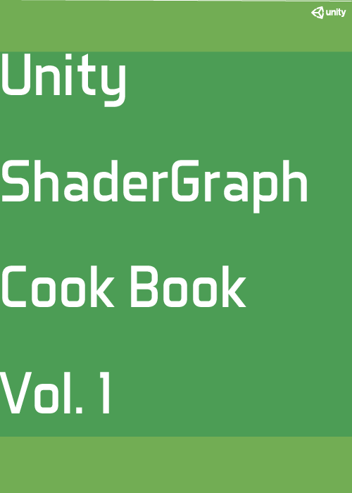

## 自己紹介
職業 : Unityエンジニア  
Twitter : https://twitter.com/rn49rn49 
GitHub : https://github.com/rngtm  
Qiita : https://qiita.com/r-ngtm  
Zenn : https://zenn.dev/r_ngtm  
はてなBlog : https://r-ngtm.hatenablog.com/ 
 

### スキル・職務経歴
* [スキル](markdown/01_skill.md) 
* [職務経歴](markdown/05_career.md) 
 

## 技術書
Unity ShaderGraphの本をリリースしました。 
  
https://zenn.dev/r_ngtm/books/shadergraph-cookbook  

## ブログ
はてなブログにて、Unityシェーダーグラフの記事を不定期で発信しています。 
https://r-ngtm.hatenablog.com/archive/category/ShaderGraph  

## リアルタイムVFX
HoudiniとUnityシェーダーグラフを組み合わせて作成したエフェクト表現です。 
<iframe width="560" height="315" src="https://www.youtube-nocookie.com/embed/vTw1rseHxHE" frameborder="0" allow="accelerometer; autoplay; clipboard-write; encrypted-media; gyroscope; picture-in-picture" allowfullscreen></iframe>

下は解説記事になります。 
https://r-ngtm.hatenablog.com/entry/2020/06/18/210918 
https://r-ngtm.hatenablog.com/entry/2020/07/15/235544 
 

## 手描きエフェクト(手描きアニメーション)
手描き調エフェクトに興味があって、練習していたことがあります。(2019/6 ~ 2020/8) 
[2DFX](markdown/09_2dfx.md)  

---

## 興味1 : ゲーム開発
ゲームを作ることに興味があります。 
 

### VRゲーム作品 : うんちゃんタワー
NEWVIEW CYPHERというイベントへ向けて、おめシスのうんちゃんを使ったVRゲームを作ってみました。 
<iframe width="560" height="315" 
src="https://www.youtube.com/embed/K1InboPOOAY" 
frameborder="0" 
allow="accelerometer; autoplay; clipboard-write; encrypted-media; gyroscope; picture-in-picture" allowfullscreen></iframe>

### 2Dゲーム作品
UnityRoomで2Dゲーム作品を8個公開しています。 
https://unityroom.com/users/ehq0janm86py35vwl4kd 

## 興味2 : CGプログラミング
技術を組み合わせて、視覚的な表現を創ることに興味があります。 
・GLSLレイマーチング・数学・物理学を使用したCG表現 
・シェーダーを利用したグラフィック表現 
・Houdini, SubstanceDesinger, Unityなどを組み合わせたエフェクト表現 
 
最近は物理ベースレンダリングに興味があり、学習を進めています。
 
[CGプログラミング](markdown/03_cg_programming.md) 
 

### GLSL作品
GLSLを使った作品はNEORTにまとめています。 
https://neort.io/Y2hWnzYpeUhPFLWEAZImqMboQI53

 
 

### シェーダー・VFXに関するアウトプット
[ゲームVFX](markdown/04_game_vfx.md) 
 

## 開発系アウトプット
[Development](markdown/02_development.md) 
