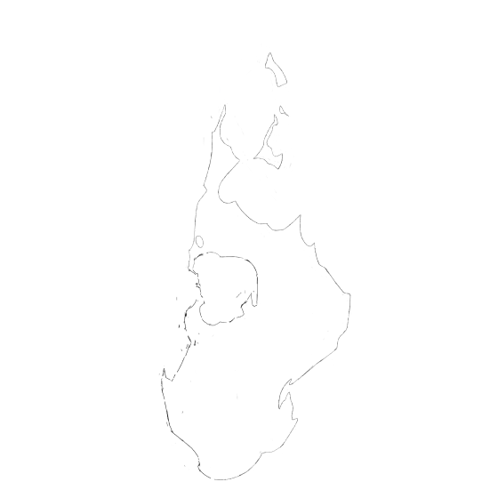
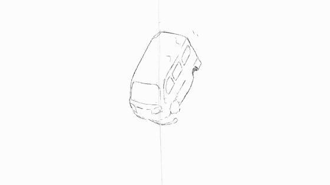
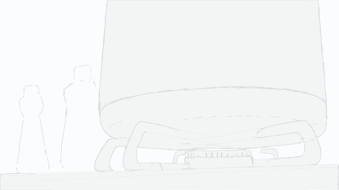
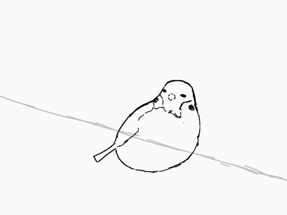

# 手描きエフェクト
iPadのClip Studio Paintで描いた手描きエフェクトなどを載せていきます 
 

# 2019
模写 

アニメ「炎炎ノ消防隊」煙エフェクトの模写 

模写 

模写 

模写 

模写 

模写 

模写 

模写 

手を開く動画の模写 

# 2020-01

アニメ「ダーウィンズゲーム」1話冒頭の電気エフェクトの模写 

アニメ「終わりのセラフ」 OP 爆発エフェクトの模写 

アニメ「リトルウィッチアカデミア」のエンディングのエフェクトの模写 

# 2020-02
炎エフェクトの模写 

アクセルワールドのキックのエフェクトを90分で模写したもの

ガスコンロの火のスケッチ 

スタージルシンプソン SOUND FURYの炎エフェクトの模写 

超電磁砲T OPの落雷エフェクトの模写 

超電磁砲S 1話の水柱エフェクトの模写 

雷エフェクトの落書き 

アニメ「火の丸相撲」 OP冒頭の炎エフェクトの模写 

# 2020-03
映画「ドラゴンボール超ブロリー」 エフェクトの模写 

ビームっぽいエフェクトの落書き 

電気エフェクトの落書き 

模写 

スズメの動画スケッチ 

模写 

模写 

コップに水を注ぐ動画の模写 

# 2020-04

電気エフェクトの落書き 

ペルソナ5 の炎エフェクトの模写 

煙エフェクトを90分で模写したもの 

